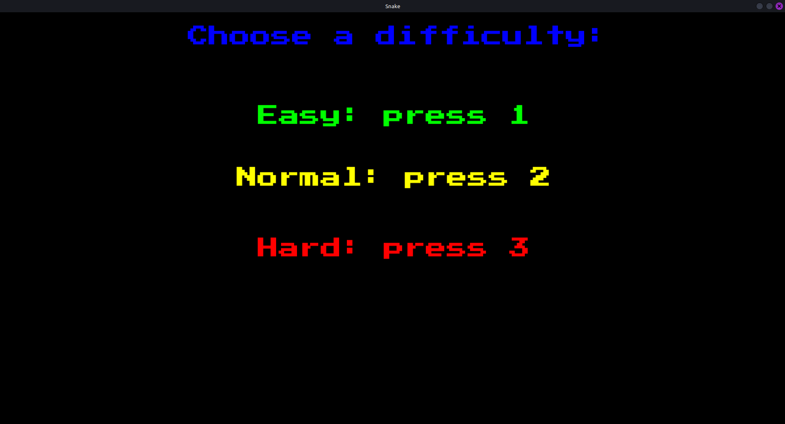
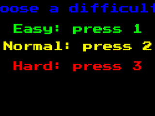

# Snake


## Table of Contents

1. [Overview](#1-overview)
2. [What the game looks like](#2-what-the-game-looks-like)
3. [How to Play](#3-how-to-play)
4. [How to Run](#4-how-to-run) 


## 1. Overview 

Snake is a popular game of collecting fruits to grow the snake and avoiding collisions. Programmed in C++.  


## 2. What the game looks like

* After successfully running the program the menu window will appear that allows to choose difficulty of the game by pressing corresponding key on keyboard:




After choosing a difficulty there will be 3 seconds countdown and game will start. To control the snake user has to use "wasd" keys or arrow keys. Visual representation below: 



## 3. How to Play

Collect blueberries, avoid colliding with walls and avoid self-colisions. Have fun.


## 4. How to Run 

### On Linux

1. First, you have to clone this repository and go into it:

```
git clone https://github.com/Gab071/Snake.git
cd Snake
```

2. Install SFML, CMake, and build tools (if not already installed):
```
sudo apt install libsfml-dev cmake build-essential
```


3. Then build the project (in the Snake folder you just cloned):
```
cmake -B build
cmake --build build
```

4. Run the game (must be run from inside the build directory for assets to load properly):
```
cd build
./Snake
```

Note: Step 4 is done this way because of the relative assest path (like *PressStart2P-Regular.ttf*)

Note: If in the future there will be updates to this game (future plans will come true) it is needed to clear old cache with a command:
```
rm -rf build
```

and repeat step 3. 


## 5. Future Plans

* Restart option for the game.
* Fixing cropped text in the start menu. 
